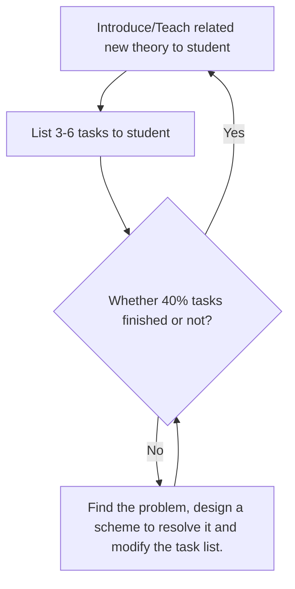

# Some bothering me problems (Update 2021-08-31)
In my working life, the low efficiency is always accompanied with me. Especially after finishing my PhD degree, we have to teach students, look after my son, and deal with the family staff, a lot of things divide my working time into small pieces. As a result, my research process is very slow, so I want to do some change to improve my working efficiency.
Firstly, I want to rise a habit of taking notes, to help me thinking or organizing my daily life. So I can immediately focus on my working in discrete time pieces. Thus, I list the following desired request about my workflow of my note.
- **How to organize my knowledge management?** For instance, I want to organize some knowledge about mathematics or mechanics. This problem will be solved by how to define the tags and templates.
- **How to record my fleeting idea?** It is about how to record it conveniently and how to do my derivation manuscript?
- **How to schedule my daily life?** I want to immediately know what am I going to do as I begin to work, and stop it whenever another staff interrupt me.

All of the notes will be created with a convenient searching mode, I am going to design a system of tagging every notes for a quickly access. The obsidian provides 3 different ways regarded as the key words for searching, i.e. tags, titles and links.  @Bryan Jenks provides a detail [Tag Taxonomy](https://publish.obsidian.md/bryan-jenks/Tag+Taxonomy) for systematically tagging.
As referring to the @Bryan Jenks's system, The tags is represented as a *status* of notes.The detail tags mapping is listed in [[✱ Tag Category]] 
The priority of tags will be represented by the color circles:
#❗️ 	- 🔴  : urgent, should do immediately as you begin to work.
	
## ❖ Knowledge management 
The knowledge management contain two parts. The one is my knowledge wiki, where some theorems and methodologies will list in it. Firstly, 

Some meta notions is useful during searching information:
	- @: people or email addresses.
	- {article or book} #❗️ (How to design the article or book title? It should be conclude authors, date and journal or publisher) 
	- fleeting notes #❗️ 
	- 
#❗️ How to automatically type the data?
	
The titles of notes can contain some meta notions to categorize the types, for now, the note types are listed as:

## Notes for references

## ☾ Daily Todolist
#❗️ [Obsidian Trello](https://github.com/OfficerHalf/obsidian-trello/)
## ∞ Test report
The notion for test/derivation report is ∞, I designate a [[∞  Frontmatter Template]], and wish it can work properly for [[✱ Plugins for Obsidian#Dataview|Dataview]]  
## Collections of good sentences for improving writing skill
## Workflow of project management with students

## Figure pool
- [MY-Easy-Pic-Bed](https://github.com/fslongjin/My-Easy-Pic-Bed)